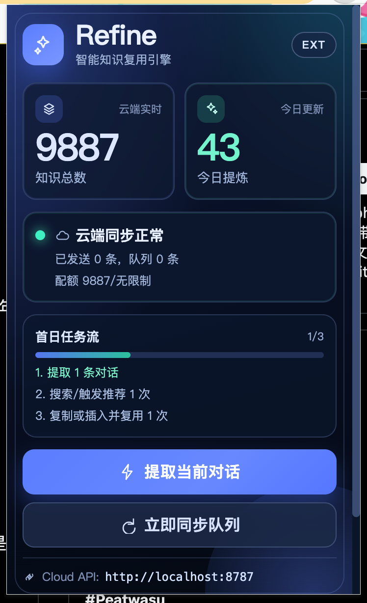

<h1 align="center">Refine</h1>

<p align="center">
  <a href="https://github.com/majiayu000/refine/actions/workflows/ci.yml"></a>
  <a href="LICENSE"></a>
  <a href="https://www.rust-lang.org"></a>
</p>

<p align="center"><strong>Re + Fine — improve continuously, conversation by conversation.</strong></p>

<p align="center">Sync knowledge from AI conversations. Track cognitive growth from coding sessions.</p>

<p align="center"><a href="./README.zh-CN.md">中文文档</a></p>

## What It Does

1. **Knowledge Sync** — Capture conversations from ChatGPT, Claude, Gemini, Grok, Claude Code, Codex into one searchable knowledge base
2. **Session Analysis** — Extract 12 cognitive dimensions from AI coding sessions (decisions, bugs, patterns, friction, knowledge gained, etc.)
3. **Cognitive Tracking (Mirror)** — 3-layer signal lights, personal baseline, LLM-powered advice, trend tracking

## Quick Start

```bash
# Install both tools
cargo install --path apps/cli      # refine
cargo install --path apps/mirror   # mirror

# Configure LLM (.env file)
cat > .env << 'EOF'
REFINE_OPENAI_API_KEY=your_key
REFINE_OPENAI_BASE_URL=https://api.openai.com
REFINE_OPENAI_MODEL=gpt-4o
EOF

# Import your AI coding sessions
refine ingest-sessions

# See your cognitive snapshot
mirror score
```

## Mirror — Cognitive Growth Tracker

Mirror extracts cognitive fingerprints from your AI coding sessions and tracks growth over time.

### Daily Usage

```bash
mirror score                        # 3-layer signal lights + LLM advice
mirror motd                         # One-line briefing (add to .zshrc)
mirror dashboard                    # Full ASCII dashboard
mirror score --since 2026-03-20     # Filter by date
```

### Periodic Analysis

```bash
mirror weekly                       # Weekly delta report (requires LLM)
mirror profile                      # Cognitive portrait narrative (requires LLM)
/cognitive-portrait                  # Deep 5-framework analysis (~1000 lines, Claude Code skill)
```

### What Mirror Tracks

**3 Layers × 11 Indicators:**

| Layer | Indicators | What It Measures |
|-------|-----------|-----------------|
| **Depth** | Dreyfus level, Decision quality, Depth output, Knowledge rate | Are you thinking at a higher level? |
| **Breadth** | Exploration rate, Deep invest, Fragmentation | Are you investing wisely across projects? |
| **Collaboration** | Delegation rate, Mode diversity, Bug/decision ratio, Friction density | Is your AI collaboration healthy? |

**Signal Lights:** 🟢 Green (healthy) / 🟡 Yellow (watch) / 🔴 Red (act now)

**Personal Baseline:** After 4 weeks, signals are relative to your own average, not fixed thresholds.

### Terminal Integration

```bash
# Add to .zshrc — shows signal lights every time you open terminal
[ -x "$(command -v mirror)" ] && mirror motd 2>/dev/null
```

**StatusLine** (Claude Code bottom bar):
```
本周243 深度🟢 广度🔴 协作🔴 每周开1次新方向探索
```

**SessionStart hook** injects cognitive dashboard + LLM advice into every Claude Code conversation.

### Automation (launchd)

| Schedule | Task | What It Does |
|----------|------|-------------|
| Daily 8:00 AM | `scripts/daily-refresh.sh` | `refine ingest-sessions` → `mirror score` |
| Weekly Mon 9:00 AM | `scripts/weekly-insights.sh` | `refine insights --prescription` (10-way LLM) |

### Configuration

```toml
# ~/.mirror/config.toml (optional, all have defaults)
[targets]
delegation_green = 0.40      # delegation < 40% = green
exploration_green = 0.15     # exploration > 15% = green
knowledge_green = 0.5        # knowledge rate > 0.5/session = green
friction_green = 1.0         # friction < 1.0/session = green
```

### Data Flow

```
~/.claude/projects/*.jsonl          ← Claude Code sessions
    │
    ▼ refine ingest-sessions        (12-dimension facet extraction via LLM)
    │
SQLite (observations, documents)    ← Shared data store
    │
    ├─ mirror score/dashboard       (local clustering → signal lights)
    ├─ mirror motd                  (reads cached scores + LLM advice)
    ├─ mirror weekly                (delta analysis via LLM)
    ├─ mirror profile               (cognitive portrait via LLM)
    └─ /cognitive-portrait          (5-framework deep analysis, Claude Code skill)
```

## Refine CLI Commands

### Session Analysis

```bash
refine ingest-sessions                  # Import all sessions (incremental)
refine ingest-sessions --source claude  # Claude Code only
refine ingest-sessions --dry-run        # Preview without LLM calls
refine insights --prescription          # L1-L4 cognitive report
refine growth                           # Legacy dashboard (use mirror dashboard instead)
```

### Knowledge Management

```bash
refine search "query"              # Search knowledge base
refine list --type observation     # List cognitive observations
refine show <id>                   # View item details
refine docs                        # List session documents
```

## Extension Preview



## Browser Extension (Plasmo)

```bash
cargo run --package refine-server  # Start API server
cd apps/extension && bun install && bun run dev
```

## Architecture

```
refine/
├── packages/core/          # Shared: SQLite, LLM client, session analysis, knowledge
├── apps/
│   ├── cli/                # refine command (ingest, insights, search, growth)
│   ├── mirror/             # mirror command (score, motd, dashboard, weekly, profile)
│   │   └── src/score/      # Signal light engine (11 indicators, personal baseline)
│   ├── server/             # API server (Axum)
│   ├── desktop/            # Desktop app (Tauri)
│   └── extension/          # Browser extension (Plasmo)
└── scripts/
    ├── daily-refresh.sh    # Daily: ingest + mirror score
    └── weekly-insights.sh  # Weekly: full LLM analysis
```

## Tech Stack

| Layer | Technology |
|-------|-----------|
| Core | Rust |
| Database | SQLite + FTS5 |
| LLM | OpenAI-compatible API |
| Terminal | unicode-width, ANSI (isatty-aware) |
| Desktop | Tauri 2.0 |
| Extension | Plasmo |

## License

MIT
