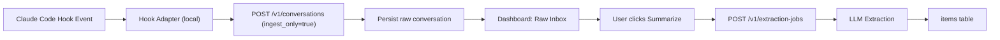

# Claude Code Hook 无感导入设计（先记录，后总结）

## 1. 目标

- 使用 Claude Code hook 作为采集入口，实现无感导入。
- 默认只记录原始对话与上下文，不触发 LLM 提炼。
- 是否总结由用户在 Dashboard 主动决定（单条或批量）。
- 保留强去重和可追踪能力，避免重复导入和重复计费。

## 2. 非目标

- 不在首次导入时自动生成 knowledge/skill/snippet。
- 不在 hook 侧做复杂 NLP 或总结逻辑。

## 3. 端到端流程



## 4. 关键设计

### 4.1 Hook 侧（采集层）

- 新增本地适配器脚本，例如 `scripts/claude_hook_ingest.sh`。
- 适配器只做四件事：
- 读取 hook 输入（stdin 或 env）。
- 组装标准 payload。
- 计算 `idempotency_key`。
- 调用 `/v1/conversations`，并带 `ingest_only=true`。

建议 payload 字段：

```json
{
  "content": "完整原始文本/增量文本",
  "url": "claude-code://session/<session-id>",
  "source": "claude_code_hook",
  "title": "Claude Session <session-id>",
  "captured_at": "2026-02-06T09:21:29Z",
  "idempotency_key": "sha256(session_id + turn_id + event_ts + content_hash)",
  "ingest_only": true,
  "metadata": {
    "session_id": "...",
    "turn_id": "...",
    "cwd": "...",
    "model": "...",
    "event_type": "..."
  }
}
```

### 4.2 服务端（入库层）

当前实现里 `POST /v1/conversations` 会直接 `spawn_extraction`。需要改成可配置模式：

- `ingest_only=true`：只存 raw conversation，不创建 extraction job。
- `ingest_only=false`：保持现有行为，自动入队提炼。

推荐接口改造：

- `POST /v1/conversations` 增加：
- `ingest_only?: bool`（默认 `false`，向后兼容）。
- `metadata?: object`（保留 hook 上下文）。

- 新增：
- `GET /v1/conversations?status=captured&cursor=0&limit=20`
- `POST /v1/conversations/:id/extract`（手动触发总结）
- `POST /v1/conversations/extract-batch`（批量总结）

### 4.3 存储模型（持久化）

当前 `conversations/jobs` 仅内存，重启丢失。需要落 SQLite。

新增表：

- `conversations`
- `id`
- `source`
- `url`
- `title`
- `raw_content`
- `metadata_json`
- `captured_at`
- `created_at`
- `status` (`captured|queued|processing|processed|failed`)
- `idempotency_key` (unique)
- `last_error`

- `extraction_jobs`
- `id`
- `conversation_id`
- `mode`
- `status`
- `created_at`
- `updated_at`
- `error`

### 4.4 Dashboard（用户决策层）

新增 Raw Inbox 视图：

- 默认列表展示 `captured` 状态原始会话。
- 支持筛选：source/session/date/hashtag。
- 支持动作：
- `立即总结`（单条）
- `批量总结`（多选）
- `归档仅保存原文`（不总结）

## 5. 去重与一致性

- Hook 侧用稳定 `idempotency_key`。
- 服务端对 `idempotency_key` 做唯一约束。
- 重复上报返回 `deduplicated=true`。
- 支持断网重试，重试不会造成重复记录。

## 6. 成本控制

- 默认 `ingest_only=true` 时，不触发 LLM，导入成本接近零（仅存储+I/O）。
- 只有用户点击总结时才调用 LLM。
- 批量总结可按预算和模型策略分批执行。

## 7. 隐私和安全

- 默认本地网络传输到用户自有服务端。
- 可选启用 `REFINE_API_TOKEN` 强制鉴权。
- 可选脱敏规则（API key、邮箱、手机号）后再入库。

## 8. 分阶段落地

Phase 1（低风险）

- 增加 `ingest_only` 开关。
- conversations/jobs 从内存迁移到 SQLite。
- Dashboard 增加 Raw Inbox + 单条手动总结。

Phase 2（完整体验）

- Claude hook 适配器脚本。
- 批量总结和队列控制。
- 更细粒度过滤（仅 marker、仅白名单路径）。

## 9. 与现有代码对齐点

- 会话创建入口：`/Users/lifcc/Desktop/code/AI/tools/refine/apps/server/src/handlers.rs`
- 自动提炼逻辑：`/Users/lifcc/Desktop/code/AI/tools/refine/apps/server/src/extraction.rs`
- 当前会话模型：`/Users/lifcc/Desktop/code/AI/tools/refine/apps/server/src/models.rs`
- 现有 Claude 导入脚本：`/Users/lifcc/Desktop/code/AI/tools/refine/scripts/import_claude_code.sh`

